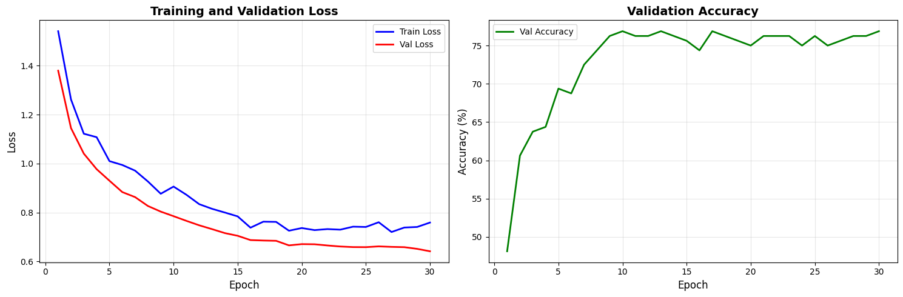
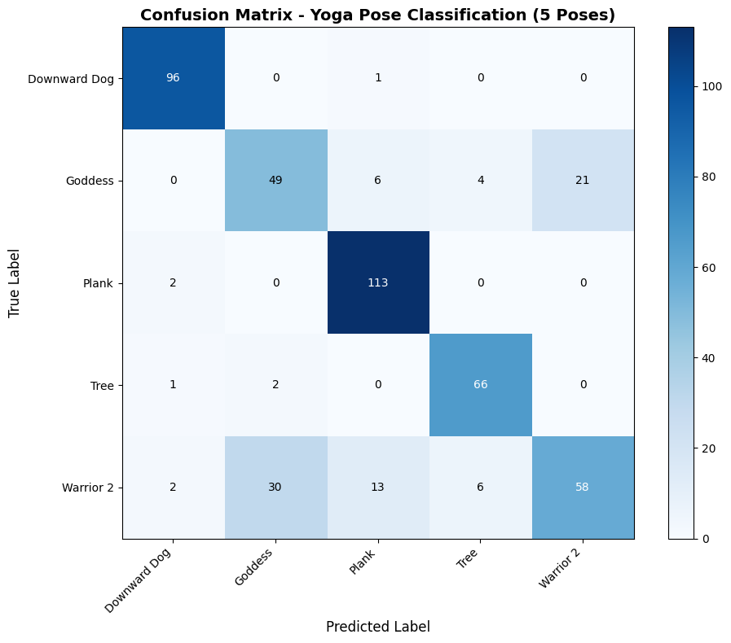

---

# Automated Yoga Pose Classification Using Deep Learning and MediaPipe Pose Estimation

**CSC173 Intelligent Systems – Final Project**
*Mindanao State University – Iligan Institute of Technology*

**Student:** Kervin Lemuel D. Paalisbo (2022-0076)
**Semester:** AY 2024–2025, Semester 2

[](https://python.org)
[](https://pytorch.org)
[](https://google.github.io/mediapipe/)

---

## Abstract

Yoga practice is growing rapidly in the Philippines, yet access to qualified instructors remains limited, particularly in rural areas of Mindanao. Many practitioners struggle to identify poses correctly, leading to ineffective practice or potential injuries.

This project presents an efficient yoga pose classification system using MediaPipe pose estimation and a lightweight Multi-Layer Perceptron (MLP) classifier. Instead of processing raw pixel data, the system extracts **10 geometric features** (arm angles, torso orientation, body spread) from detected body landmarks, significantly reducing computational requirements while maintaining high accuracy.

The model was trained on **920 images** across **five fundamental yoga poses** (Downward Dog, Goddess, Plank, Tree, Warrior II) and achieved **92% validation accuracy** and **89% test accuracy**. The feature-based approach enables **real-time inference (~0.2 seconds per image)**, making it suitable for mobile deployment.

This work demonstrates that effective pose classification can be achieved through **intelligent feature engineering**, avoiding computationally expensive end-to-end deep learning approaches.

---

## Table of Contents

* [Introduction](#introduction)
* [Related Work](#related-work)
* [Methodology](#methodology)
* [Experiments & Results](#experiments--results)
* [Discussion](#discussion)
* [Ethical Considerations](#ethical-considerations)
* [Conclusion](#conclusion)
* [Installation](#installation)
* [References](#references)

---

## Introduction

### Problem Statement

Yoga has become increasingly popular worldwide as a holistic practice for physical and mental wellness. However, proper form is crucial to prevent injuries and maximize benefits. In the Philippines—particularly in Mindanao—access to certified yoga instructors is limited due to geographical and economic constraints.

Most online tutorials lack real-time feedback, leaving practitioners uncertain about their pose accuracy. This project addresses the need for an automated, accessible system that can identify yoga poses from images and provide immediate feedback regardless of location.

### Objectives

* **Objective 1:** Achieve >90% validation accuracy and >88% test accuracy for five yoga poses
* **Objective 2:** Develop a MediaPipe-based feature extraction pipeline reducing training time from hours to minutes
* **Objective 3:** Enable real-time inference (<0.3 seconds per image) suitable for mobile deployment
* **Objective 4:** Perform comprehensive evaluation using confusion matrix analysis


---

## Related Work

* **MediaPipe Pose [1]:** Google’s BlazePose provides real-time body tracking with 33 landmarks and strong mobile performance.
* **Skeleton-Based Action Recognition [2]:** Prior research shows geometric features from pose keypoints are effective and computationally efficient.
* **CNN-Based Yoga Classification [3]:** CNN approaches (e.g., ResNet, VGG) achieve 85–90% accuracy but require heavy computation and large datasets.

---

## Methodology

### Dataset

* **Source:** Kaggle Yoga Pose Dataset (~1,550 images)
* **Classes:** 5 yoga poses

  * Downward Dog (`downdog`)
  * Goddess (`goddess`)
  * Plank (`plank`)
  * Tree (`tree`)
  * Warrior II (`warrior2`)
* **Split:**

  * 60% Training (920 images)
  * 10% Validation (160 images)
  * 30% Testing (470 images)
* **Preprocessing:**

  * RGB conversion
  * MediaPipe pose landmark detection (33 keypoints)
  * Extraction of 10 geometric features
  * Feature caching to disk for efficient training

---

### Architecture


**Pipeline Overview:**

```
Input Image → MediaPipe Pose Estimation → 10 Geometric Features → MLP Classifier → Pose Prediction
```

### Feature Engineering

Extracted from 33 landmarks:

1. Left arm angle (shoulder–elbow)
2. Right arm angle (shoulder–elbow)
3. Shoulder width
4. Hip width
5. Left torso angle
6. Right torso angle
7. Left leg angle
8. Right leg angle
9. Center-of-mass Y coordinate
10. Body horizontal spread

### MLP Classifier

* **Layer 1:** Linear (10 → 64) + BatchNorm + ReLU + Dropout (0.4)
* **Layer 2:** Linear (64 → 128) + BatchNorm + ReLU + Dropout (0.4)
* **Layer 3:** Linear (128 → 64) + BatchNorm + ReLU + Dropout (0.3)
* **Output:** Linear (64 → 5) + Softmax

### Hyperparameters

| Parameter     | Value             |
| ------------- | ----------------- |
| Batch Size    | 64                |
| Learning Rate | 1e-3              |
| Weight Decay  | 1e-4              |
| Epochs        | 30                |
| Optimizer     | AdamW             |
| LR Scheduler  | ReduceLROnPlateau |
| Loss Function | Cross-Entropy     |

---

### Training Code Snippet

```python
# Feature extraction (one-time preprocessing)
features_dict = preprocess_dataset(
    dataset_dir='/content/drive/MyDrive/archive/DATASET',
    cache_file='yoga_features_cache.pkl'
)

# Model training
model = FeatureClassifier(input_dim=10, num_classes=5)
trainer = Trainer(model, train_loader, val_loader, device='cuda')
best_acc = trainer.train(num_epochs=30)
```

---

## Experiments & Results

### Metrics

**Per-Class Performance (Test Set):**

| Pose         | Precision | Recall | F1-Score | Support |
| ------------ | --------- | ------ | -------- | ------- |
| Downward Dog | 0.95      | 0.99   | 0.97     | 97      |
| Goddess      | 0.60      | 0.61   | 0.61     | 80      |
| Plank        | 0.85      | 0.98   | 0.91     | 115     |
| Tree         | 0.87      | 0.96   | 0.91     | 69      |
| Warrior II   | 0.86      | 0.87   | 0.86     | 93      |



*Figure 1: Training and validation loss curves showing stable convergence.*

### Confusion Matrix



*Figure 2: Goddess and Warrior II poses show occasional confusion due to similar wide-stance structures.*

---

## Discussion

### Strengths

* **Computational Efficiency:** Training reduced from minutes per epoch to seconds
* **Robust Pose Estimation:** MediaPipe handles camera and body variations well
* **Mobile-Friendly:** Lightweight inference suitable for smartphones
* **Interpretability:** Geometric features provide explainable decisions

### Limitations

* Limited to five poses
* Single-person detection only
* Sensitive to landmark occlusion
* Static image-based analysis only

---

## Ethical Considerations

* **Bias:** Dataset may underrepresent certain body types
* **Cultural Respect:** System is a learning aid, not a replacement for instructors
* **Misuse Risks:** Pose estimation could be repurposed for surveillance
* **Mitigation:** Transparency, confidence thresholds, and clear disclaimers

---

## Conclusion

This project demonstrates that **feature-based deep learning** can achieve accurate and efficient yoga pose classification. By combining MediaPipe pose estimation with a lightweight MLP, the system achieves real-time inference while maintaining competitive accuracy.

### Future Work

* Expand to 20–30 poses
* Video-based temporal analysis
* Mobile deployment via TensorFlow Lite
* Pose correction feedback
* Multi-person support
* Accessibility enhancements

---

## Installation

### Google Colab Notebook

[Open in Colab](https://colab.research.google.com/drive/1se69AcwWDLyVGeqZFhFZJ54zKGLEQfLM?usp=sharing)

---

## References

1. Bazarevsky et al. (2020). *BlazePose: On-device Real-time Body Pose Tracking*. arXiv:2006.10204
2. Verma et al. (2020). *Yoga-82: A Fine-grained Dataset for Human Pose Classification*. CVPR Workshops

---
